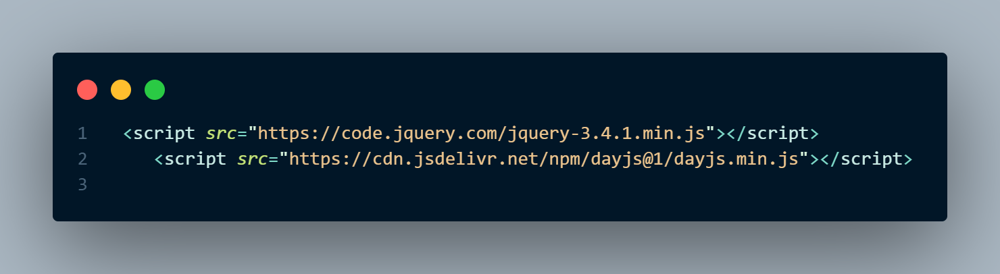

# Word Day Scheduler

Live Deployed Link - https://greenie115.github.io/work-day-scheduler/
## Installation

There is no installation required for this project. Simply open the link above and use the application as intended. 

## Usage
The app uses ```daysjs()``` to calculate the time and date for the planner. This does mean we are using the ```JQuery``` CDN and UI library so utilize this feature. 

-snippet.png)


Right now the JS file does not follow DRY conventions but will be updated once I've been able to find a better solution to work around the ```JQuery``` DOM. Feel free to submit a request with a solution. 

## Contributing

Pull requests are welcome. For major changes, please open an issue first
to discuss what you would like to change.

Please make sure to update tests as appropriate.

## License

[MIT](https://choosealicense.com/licenses/mit/)